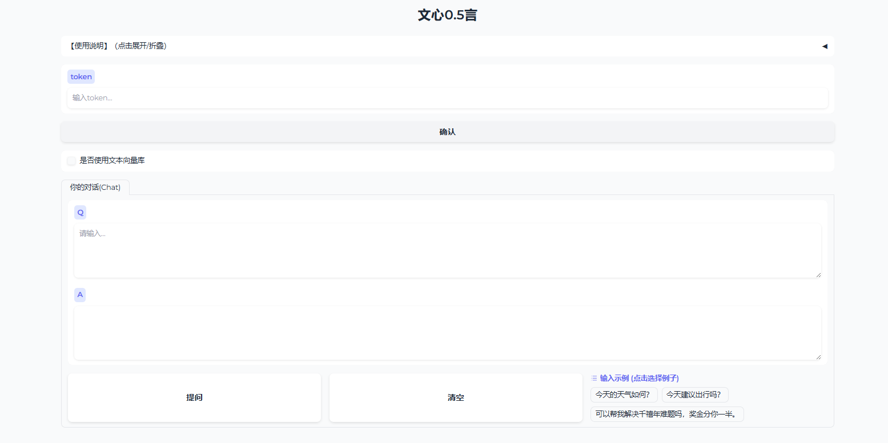

# wenxin0.5yan

**本项目是一个简单的调用文心一言API，并使用Gradio部署前端的项目。**

若要启动该项目，请在安装依赖后，运行目录下的 `webui.py` ，并在启动后选择在浏览器打开。

该版本默认使用的向量库基于《中国脑卒中防治指导规范（2021 年版）》生成。

用户可以上传自己的向量索引文件，也可以将文本文件上传至data目录下，在下一块代码中填入token并运行，可以在index目录下生成向量索引文件。

